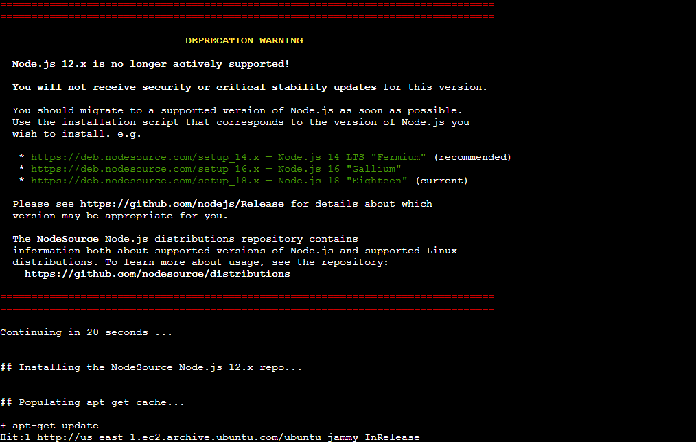
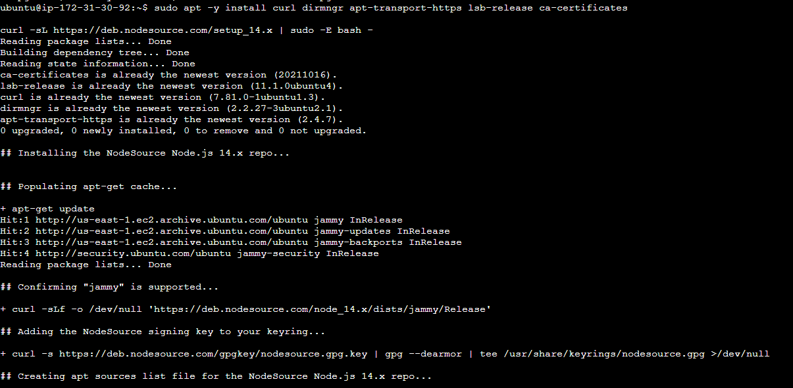
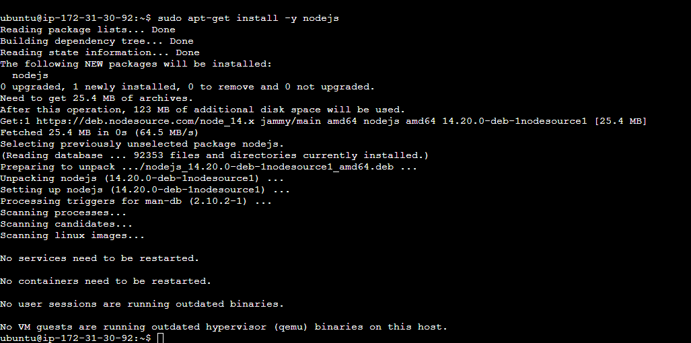
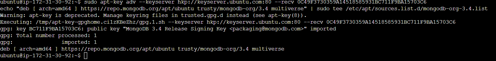
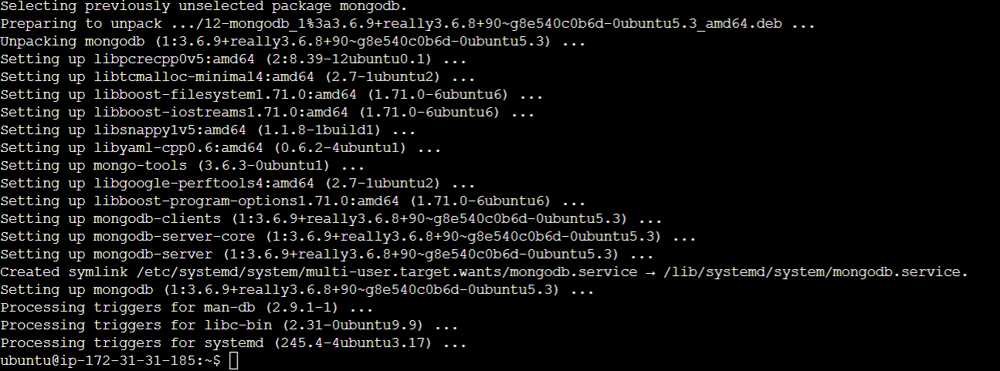
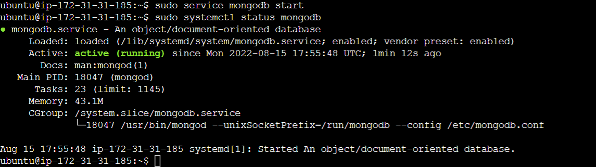
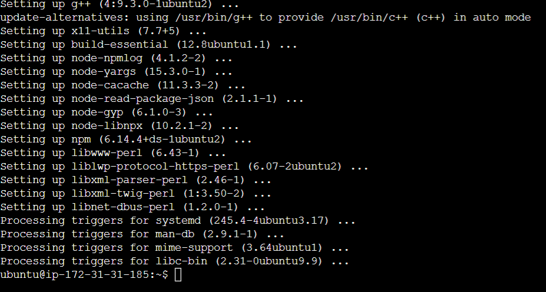
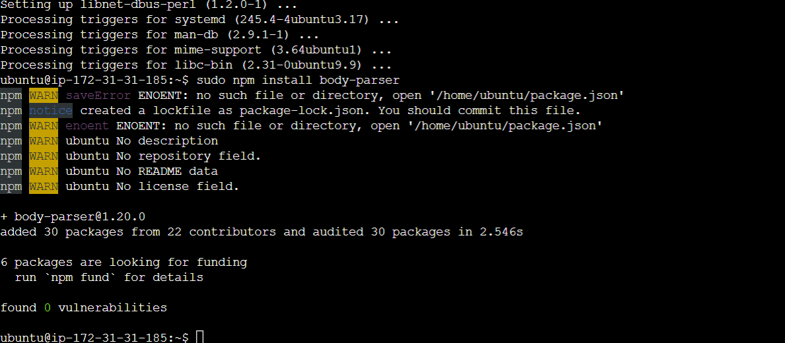
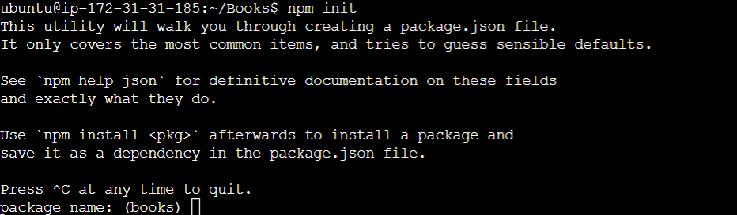
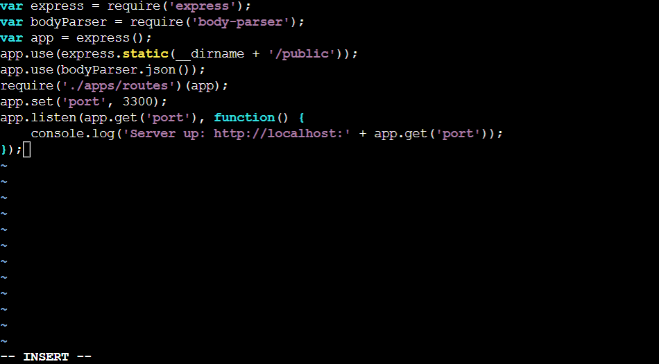

# Documentation for Project 4 (MEAN)

## Install NodeJs and Install MongoDB

Installing NodeJS:

`sudo apt update`

`sudo apt upgrade`

Add certificates:

`sudo apt -y install curl dirmngr apt-transport-https lsb-release ca-certificates`

`curl -sL https://deb.nodesource.com/setup_12.x | sudo -E bash -`

After seeing that version of nodejs is no longer supported, I decided to change the code to a newer verison 14 (recommended):

Then ran the command below to install it:

`sudo apt-get install -y nodejs`

Install MongoDB

**Note: it was at this point that installing mongoDB was not working and I realised that I was using the wrong ubuntu version (22.04) instead of 20.04**

`sudo apt-key adv --keyserver hkp://keyserver.ubuntu.com:80 --recv 0C49F3730359A14518585931BC711F9BA15703C6`

`echo "deb [ arch=amd64 ] https://repo.mongodb.org/apt/ubuntu trusty/mongodb-org/3.4 multiverse" | sudo tee /etc/apt/sources.list.d/mongodb-org-3.4.list`

`sudo apt install -y mongodb`

Now start the service and make sure it runs:

`sudo service mongodb start`

`sudo systemctl status mongodb`

Install Node package manager and body-parser package:

`sudo apt install -y npm`

`sudo npm install body-parser`

Create Books folder and initialize npm:

`mkdir Books && cd Books`

`npm init`

Add server.js file:

`vi server.js`

Copy and paste the web server code below into the server.js file:

<!-- var express = require('express');
var bodyParser = require('body-parser');
var app = express();
app.use(express.static(__dirname + '/public'));
app.use(bodyParser.json());
require('./apps/routes')(app);
app.set('port', 3300);
app.listen(app.get('port'), function() {
    console.log('Server up: http://localhost:' + app.get('port'));
}); -->

