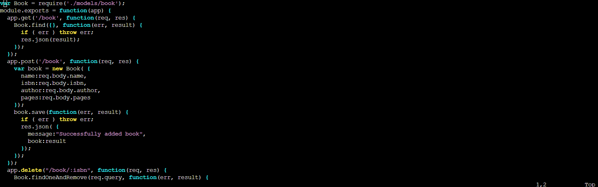

# Documentation for Project 4 (MEAN)

## Install NodeJs and Install MongoDB

Installing NodeJS:

`sudo apt update`

`sudo apt upgrade`

Add certificates:

`sudo apt -y install curl dirmngr apt-transport-https lsb-release ca-certificates`

`curl -sL https://deb.nodesource.com/setup_12.x | sudo -E bash -`

After seeing that version of nodejs is no longer supported, I decided to change the code to a newer verison 14 (recommended):

Then ran the command below to install it:

`sudo apt-get install -y nodejs`

Install MongoDB

**Note: it was at this point that installing mongoDB was not working and I realised that I was using the wrong ubuntu version (22.04) instead of 20.04**

`sudo apt-key adv --keyserver hkp://keyserver.ubuntu.com:80 --recv 0C49F3730359A14518585931BC711F9BA15703C6`

`echo "deb [ arch=amd64 ] https://repo.mongodb.org/apt/ubuntu trusty/mongodb-org/3.4 multiverse" | sudo tee /etc/apt/sources.list.d/mongodb-org-3.4.list`

`sudo apt install -y mongodb`

Now start the service and make sure it runs:

`sudo service mongodb start`

`sudo systemctl status mongodb`

Install Node package manager and body-parser package:

`sudo apt install -y npm`

`sudo npm install body-parser`

Create Books folder and initialize npm:

`mkdir Books && cd Books`

`npm init`

Add server.js file:

`vi server.js`

Copy and paste the web server code below into the server.js file:

<!-- var express = require('express');
var bodyParser = require('body-parser');
var app = express();
app.use(express.static(__dirname + '/public'));
app.use(bodyParser.json());
require('./apps/routes')(app);
app.set('port', 3300);
app.listen(app.get('port'), function() {
    console.log('Server up: http://localhost:' + app.get('port'));
}); -->

## Install Express and set up routes to the server

First install Mongoose package to establish a schema for the database to store data of the book register

`sudo npm install express mongoose`

Inside Books folder create another folder called apps:

`mkdir apps && cd apps`

Create a file called routes.js and insert code:

`vi routes.js`

<!-- var Book = require('./models/book');
module.exports = function(app) {
  app.get('/book', function(req, res) {
    Book.find({}, function(err, result) {
      if ( err ) throw err;
      res.json(result);
    });
  }); 
  app.post('/book', function(req, res) {
    var book = new Book( {
      name:req.body.name,
      isbn:req.body.isbn,
      author:req.body.author,
      pages:req.body.pages
    });
    book.save(function(err, result) {
      if ( err ) throw err;
      res.json( {
        message:"Successfully added book",
        book:result
      });
    });
  });
  app.delete("/book/:isbn", function(req, res) {
    Book.findOneAndRemove(req.query, function(err, result) {
      if ( err ) throw err;
      res.json( {
        message: "Successfully deleted the book",
        book: result
      });
    });
  });
  var path = require('path');
  app.get('*', function(req, res) {
    res.sendfile(path.join(__dirname + '/public', 'index.html'));
  });
}; -->

In the apps folder, create a folder called models:

`mkdir models && cd models`

Create a file called book.js and copy code into it:

`vi book.js`

## Access the routes with AngularJS

Create a folder called public inside of Books folder

`mkdir public && cd public`

Add a file called script.js and add the code:

`vi script.js`

<!-- var app = angular.module('myApp', []);
app.controller('myCtrl', function($scope, $http) {
  $http( {
    method: 'GET',
    url: '/book'
  }).then(function successCallback(response) {
    $scope.books = response.data;
  }, function errorCallback(response) {
    console.log('Error: ' + response);
  });
  $scope.del_book = function(book) {
    $http( {
      method: 'DELETE',
      url: '/book/:isbn',
      params: {'isbn': book.isbn}
    }).then(function successCallback(response) {
      console.log(response);
    }, function errorCallback(response) {
      console.log('Error: ' + response);
    });
  };
  $scope.add_book = function() {
    var body = '{ "name": "' + $scope.Name + 
    '", "isbn": "' + $scope.Isbn +
    '", "author": "' + $scope.Author + 
    '", "pages": "' + $scope.Pages + '" }';
    $http({
      method: 'POST',
      url: '/book',
      data: body
    }).then(function successCallback(response) {
      console.log(response);
    }, function errorCallback(response) {
      console.log('Error: ' + response);
    });
  };
}); -->

Inside of public folder called a file called index.html and add code:

`vi index.html`

<!-- <!doctype html>
<html ng-app="myApp" ng-controller="myCtrl">
  <head>
    
    
  </head>
  <body>
    

      <table>
        <tr>
          <td>Name:</td>
          <td><input type="text" ng-model="Name"></td>
        </tr>
        <tr>
          <td>Isbn:</td>
          <td><input type="text" ng-model="Isbn"></td>
        </tr>
        <tr>
          <td>Author:</td>
          <td><input type="text" ng-model="Author"></td>
        </tr>
        <tr>
          <td>Pages:</td>
          <td><input type="number" ng-model="Pages"></td>
        </tr>
      </table>
      <button ng-click="add_book()">Add</button>
    

    

    

      <table>
        <tr>
          <th>Name</th>
          <th>Isbn</th>
          <th>Author</th>
          <th>Pages</th>

        </tr>
        <tr ng-repeat="book in books">
          <td>{{book.name}}</td>
          <td>{{book.isbn}}</td>
          <td>{{book.author}}</td>
          <td>{{book.pages}}</td>

          <td><input type="button" value="Delete" data-ng-click="del_book(book)"></td>
        </tr>
      </table>
    

  </body>
</html> -->

Edit the inbound rules to allow TCP port 3300:

Go back to the Books folder and start the server:

`node server.js`

As shown in the image there was an error when trying to run the server. I did some research into the error message 'TextEncoder is not defined'. I found that I can fix the issue by going into the file that is highlighted in the image and add the code below to the top part of the file:

const util = require('util');
const {TextDecoder, TextEncoder} = require("util");

This lead to the server working:

Put in the publicIP with the port 3300:

I think the documentation in Project 4 should be updated since I followed everything and had the issue with encoding.